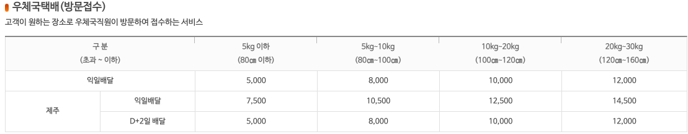
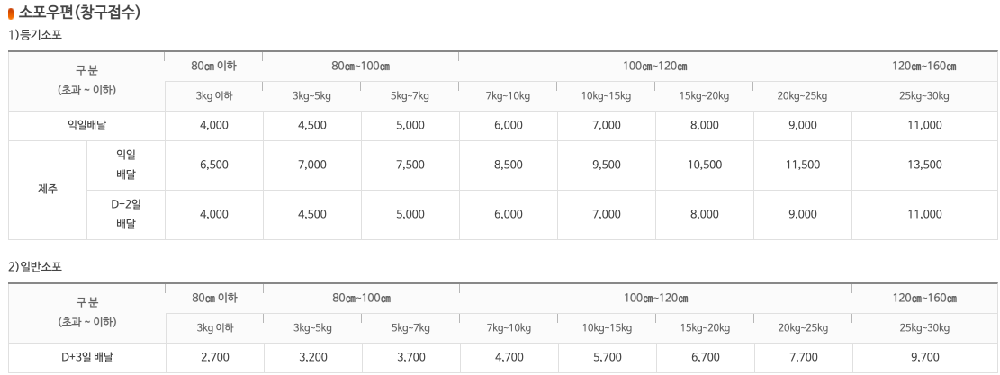
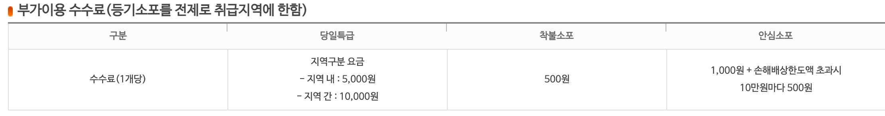
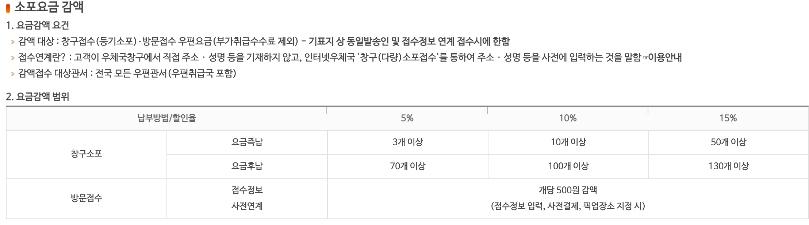

# DATA TABLE

접근성 높은 테이블 제작 과제

## **TABLE 구성 요소**
태그  | 설명 | 속성
:--|---|---|
table | 테이블 시작과 종료 | 
tr    | 행을 의미하는 요소 |
th    | 테이블의 제목 셀을 의미 | scope:해당 셀이 영향을 주는 내용 셀의 범위를 지정
td    | 테이블의 내용 셀을 의미
caption | 테이블 요소에 제목이나 설명  테이블 요소에서 가장 먼저 마크업 (필수X)
col   | 테이블의 열 그룹 |
colgroup | 열을 그룹화 | span: 그룹화한 열의 개수
thead | 테이블의 제목 셀 그룹
tbody | 테이블의 본문 행(원래 필수)
tfoot | 합계 등의 정보에 해당하는 푸터

 

### thead, tfoot의 장점
- 문서가 인쇄할 때 여러 장에 걸쳐 출력되는 경우 페이지마다 thead, tbody 정보 출력 가능
- thead 다음에 tfoot 요소의 정보가 위차하여 순차적으로 콘텐츠 접근
  - 시간 장애인의 경우, 굳이 모든 셀의 정보를 읽지 않아도 테이블의 종합 정보를 먼저 알 수 있음

### scope, id, headers 속성
- 화면 낭독기의 경우 왼쪽에서 오른쪽으로 읽어줌
  - 해당 방향으로 셀의 내용만 듣고 열과 행을 파악하여 셀의 연관성을 유추하기 어려움
  - 그러므로, th 요소에 **scope** 속성을 사용해야 함
- th 요소
  - scope 속성 지정 시 해당 셀이 열의 제목인지, 행의 제목인지 등을 알 수 있음
    - col, row, rowgroup, colgroup 할당 
    - 해당 속성의 경우 주로 병합되지 않은 단순한 형태의 테이블 유형에서 사용
  - 복잡한 형태의 테이블의 경우
    - th 요소에 **id** 속성으로 네이밍 후 해당 셀과 연관 있는 셀에 **headers** 속성과 id 값을 연결하여 관계를 지정
  - (scope) 와 (id, headers)는 테이블의 구조에 맞추어 둘 중 하나를 선택하여 사용

 

## 기타 속성
---
속성 | 의미 |
:---:|:---:|
colspan | 열이 서로 다른 셀을 병합
rowspan | 행이 서로 다른 셀을 병합

 

## **HTML 테이블 접근 방법**

---

### **우체국택배(방문접수)**

- 테이블 구분을 위해 **class** 속성을 사용해 "post-delivery-service"라는 별칭 부여
- &lt;caption&gt; 태그를 사용해 해당 테이블의 제목을 지정
  - 사이트 확인 시 "우체국택배(방문접수) 요금안내" 내용으로 확인
  - 아래에 간단한 설명은 &lt;p&gt; 태그를 사용해 처리
- 행과 열의 구성 파악: 4행 6열
  - 테이블의 열 그룹을 명시하기 위해 &lt;col&gt;, &lt;colgroup&gt; 태그 사용
  - 1행의 요소들은 각 열의 제목 셀으로 확인
- &lt;thead&gt;에 속하는 헤더 요소들이 한 줄에 있으므로 **scope** 속성을 사용해 관계 명시
  - 1행의 제목 셀 요소들에게 **scope** 속성 값으로 "col"을 부여
- &lt;tbody&gt;에 속하는 요소들 중 2행의 1열, 3-4행의 1, 2열은 행의 제목으로 확인
  - score 속성 값으로 "row"을 부여
  - 3-4행의 1열의 경우 셀 병합이 되있으므로 3열을 작성할 때 rowspan 속석으로 "2"를 부여
  - 4행 작성 시 3행 1열의 셀 병합을 생각하고 각 셀을 작성

 

### **소포우편(창구접수)**

- 두 개의 테이블의 헤더 구성이 비슷하여 동시 진행
- &lt;caption&gt; 태그를 사용해 해당 테이블의 제목을 지정
  - 테이블을 각각 제작하기 위해 대제목과 부제목을 합침
    - 등기소포 : 등기소포 우편(창구접수) 요금안내
    - 일반소포 : 일반소포 우편(창구접수) 요금안내
- 각 테이블을 구분하기 위해 **class** 속성 사용
  - 등기소포 : "registered-parcel"
  - 일반소포 : "general-parcel"
- 행과 열의 구성 파악
  - 등기소포 : 5행 10열
  - 일반소포 : 3행 9열
  - 테이블의 열 그룹을 명시하기 위해 &lt;col&gt;, &lt;colgroup&gt; 태그 사용
  - 1-2행의 요소들이 각 열의 제목 셀로 확인
  - 3~5행의 1-2열을 각 행의 제목 셀로 확인
- 해당하는 테이블들은 thead가 2줄이 되어 복잡한 양식으로 판단
  - scope가 아닌 (id, headers)를 사용하여 관계 명시
    - 각 셀의 아이디: 테이블의 별칭 + 셀 번호
    - 아이디 형식: 케밥 케이스
- 분석한 내용을 바탕으로 코드 작성

 

### **부가이용 수수료(등기소포를 전제로 취급지역에 한함) 및 소포요금 감액 범위**

- 두 개의 테이블의 구성 방식이 비슷하다고 판단하여 동시에 분석 진행
- &lt;caption&gt; 태그를 사용해 해당 테이블의 제목을 지정
  - 부가이용 수수료 : 부가이용 수수료(등기소포를 전제로 취급지역에 한함)
  - 소포요금 감액 : 소포요금 감액 범위
- 각 테이블을 구분하기 위해 **class** 속성 사용
  - 부가이용 수수료 : "additional-fees"
  - 소포요금 감액 : "parcel-charge-reduction"
- 행과 열의 구성 파악
  - 부가이용 수수료 : 2행 4열
  - 소포요금 감액 : 4행 5열
  - 행과 열의 개수는 다르나 thead가 1줄이 되어 복잡하지 않은 양식으로 판단
    - scope 속성을 사용하여 관계를 명시
 

## 참고자료
---
- https://webclub.tistory.com/264
- https://seulbinim.github.io/WSA/table.html#scope-id-headers-%EC%86%8D%EC%84%B1
- https://webclub.tistory.com/611