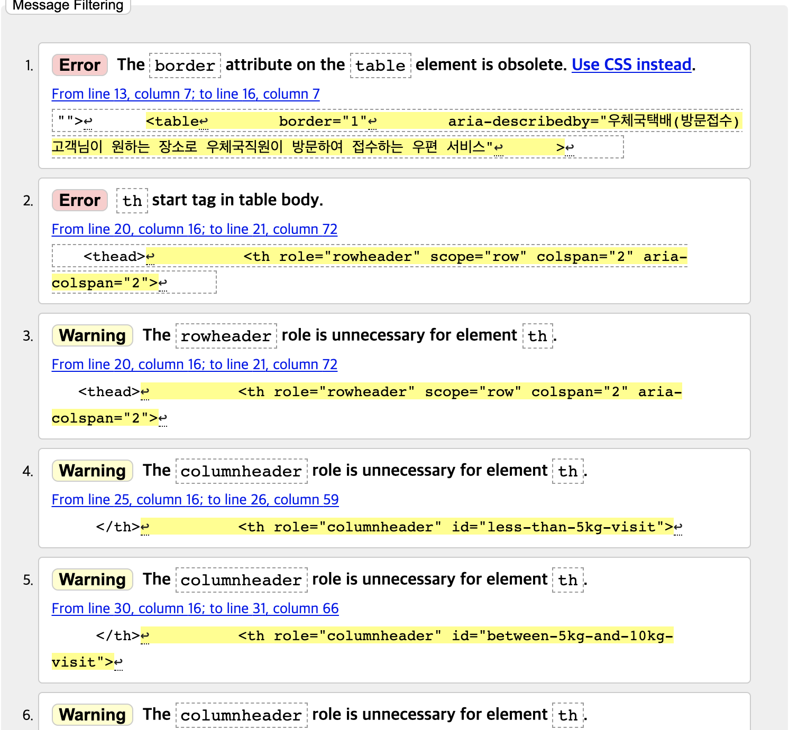

# 인터넷우체국 요금안내([링크](https://parcel.epost.go.kr/parcel/use_guide/charge_1.jsp)) 테이블 마크업 실습

> created by 허재혁(Jack2ee)
> created at 20210423

## 1. 테이블 분석

- 해당 페이지에 제시된 표는 총 5개이다. 각 표는 [W3의 Web Accessbility Tutorials 중 Table Concepts](https://www.w3.org/WAI/tutorials/tables/)를 기반하여 구조적으로 분석하면 다음과 같다.

1. 우체국택배(방문접수) 테이블: [Tables with irregular headers](https://www.w3.org/WAI/tutorials/tables/irregular/)
1. 소포우편(창구접수) 테이블
   1. 등기소포 테이블: [Tables with irregular headers](https://www.w3.org/WAI/tutorials/tables/irregular/)
   1. 일반소포 테이블: [Tables with irregular headers](https://www.w3.org/WAI/tutorials/tables/irregular/)
1. 부가이용 수수료 테이블: [Tables with one header](https://www.w3.org/WAI/tutorials/tables/one-header/)
1. 소포요금 감액 범위 테이블: [Tables with irregular headers](https://www.w3.org/WAI/tutorials/tables/irregular/)

## 2. 테이블 제작

테이블을 제작하면서 유의했던 사항을 정리한다.
표 자체가 2차원 정보를 담고 있으므로 시각장애인이 표의 구조와 내용을 이해하는 데에는 어려움이 크다고 판단하여 표의 내용을 잘 전달하는 것을 목표로 하였다.
이를 위해 다음의 속성을 table에 최대한 적용하려고 하였다.

1. `thead`, `tbody`, `troot`

> table 마크업 시 thead와 tfoot이 없어도 구성가능하다. 그럼에도 불구하고 thead와 tfoot 요소를 사용하는 이유는 다음과 같다.
>
> 1. 웹 브라우저에 따라 테이블의 데이터가 매우 많기 때문에 인쇄할 때 여러 장에 걸쳐 출력되는 경우 페이지마다 테이블의 thead, tfoot 정보를 인쇄할 수 있다.
> 1. thead 요소 다음에 tfoot 요소의 정보가 위치하여 순차적으로 콘텐츠에 접근하는 시각 장애인의 경우에 점수 통계 및 등수와 같은 테이블 종합 정보를 일일이 모든 셀의 데이터를 읽지 않다도 먼저 알 수 있다.

1. `caption`

> `caption` 요소는 table 요소에 제목이나 설명을 마크업할 때 사용하는 요소이다.
> `caption` 요소는 table 요소 안에서 가장 먼저 마크업해야 하며, 필수 요소는 아니다.
> 필수 요소가 아닐지라도 시각장애인에게 표의 주제 내지 대상을 표의 정보 초반에 제공해주는 것이 효과적이라고 생각한다.

1. th 요소의 `role`, `scope`, `id`

- role, scope

  > 해당 테이블을 분석해보니 여러 행과 열에 걸쳐 span되는 table header가 많았다.
  > 이는 소리로 표의 구조를 전달하려할 때 시각장애인분들에게 큰 혼란을 줄 것이라고 생각하여 span되는 table header임을 알릴 필요가 있다.
  > 이를 위해 th 요소에 해당 header가 행의 header인지, 열의 header인지 아니면 다른 header를 묶는 header인지 명시해야 했다.
  > 구체적으로 `role`에 rowheader와 columnheader 여부를, `scope`에 단일 행/열 header(column/rowg)인지, 그룹 행/열 header(columngroup/rowgroup)인지를 적시하였다.

- id
  > th와 th와 연결되는 td의 구체적인 내용을 연결해주기 위해 모든 th에 각각 다른 id를 부여하였다. 구분되는 테이블에서는 중복되는 id를 사용할 수 있겠지만 명확히 구분하기 위해 네이밍에 신경썼다.
  > th에 부여된 `id`값을 td의 `headers`에 담아주었다. 2차원 내용이기 때문에 복수의 th `id`를 가질 수 있음은 물론이다.

1. td 요소의 headers

   > 표를 구성하면서 가장 많은 시간이 걸린 작업이다.
   > 복수의 th 요소가 td와 연결되기 때문에 td의 `headers`에 그와 관련되는 th의 `id`값을 단일 공백을 기준으로 모두 적용하였다.

1. aria-describedby
   > 해당 table에 대한 설명을 적은 요소의 `id`를 table의 `aria-describedby` 속성과 연결해주면 표에 대한 보다 풍부한 설명을 제공받을 수 있다.

~~1. table summary~~

> summary 내용을 table의 속성으로 제공하려고 했으나 이를 `caption`으로 대체하라는 W3의 권고에 따라 `caption`으로 대체하였다.

## 디버깅, 느낀 점

대략적인 layout을 완성하고 난 뒤에 Web Developer로 유효성을 검사해보니 다음과 같은 결과를 얻었다.

시멘틱 마크업과 스타일을 분리해야 한다는 간단히 처리해야할 수 있는 문법적 문제부터 추가적인 자료조사가 필요했던 결과도 얻을 수 있었다.
위의 테이블 제작에서 고려한 포인트들이 문법적인 오류를 검증하는 와중에 떠오르기도 하였다.
얼마나 완벽히 커버할지는 체감되지 않지만 처음으로 웹 접근성을 고려하여 정보를 배치하고 적용하는 과정이 수고로울지라도 이를 효과적으로 전달하기 위한 방법을 생각하는 과정이 흥미로웠다.

## Reference

- https://www.w3.org/WAI/tutorials/tables/
- https://www.w3.org/TR/html401/struct/tables.html#:~:text=11.1%20Introduction%20to%20tables,rows%20and%20columns%20of%20cells.
- https://developer.mozilla.org/en-US/docs/Web/HTML/Element/th
- https://developer.mozilla.org/en-US/docs/Web/Accessibility/ARIA/ARIA_Techniques/Using_the_aria-describedby_attribute
- https://jack2ee-dev.github.io/2021/04/20/%EC%9B%B9-%EC%A0%91%EA%B7%BC%EC%84%B1-Web-Accessbility/
- https://webclub.tistory.com/264
