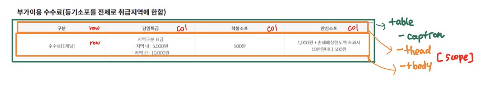

## 웹접근성을 고려한 테이블 마크업 하기

#### 🧐 고려사항

일반 사용자의 경우에는 웹 페이지의 테이블을 열과 행, 셀로 구별하는 것이 어렵지 않다. 하지만 시각 장애가 있는 사용자나 스크린 리더의 경우에는 왼쪽에서 오른쪽으로 셀의 내용만 듣고 판단하기 때문에 표의 내용을 파악하는 것이 쉽지 않다. 따라서 웹접근성을 고려한 테이블을 마크업할 때 필요한 내용을 정리했다.

✅ [`<th>, <td>` 요소 사용](#wa1)  
✅ [`<thead>, <tbody>, <tfoot>` 요소 사용](#wa2)  
✅ [셀의 관계지정1 - `<th>` 요소에 `scope` 속성 명시](#wa3)  
✅ [셀의 관계지정2 - `id, headers` 속성 명시](#wa4)  
✅ [표제목 - `caption` 명시](#wa5)  
✅ [표내용 요약 - `summary` 명시](#wa6)  
✅ [기타 고려사항](#wa7)  

---

<h4 id="wa1">1. &lt;th&gt;, &lt;td&gt; 요소 사용</h4>

th 요소는 데이터 테이블의 **제목 셀** 을 의미하고, 데이터 테이블의 필드에 해당한다.  
td 요소는 테이블의 **내용 셀** 을 의미한다.

<h4 id="wa2">2. &lt;thead&gt;, &lt;tbody&gt;, &lt;tfoot&gt; 요소 사용</h4>

colgroup이 열(수직, col)을 그룹화 한다면, 이 세가지 요소들은 행(가로, row)을 그룹화 하는 역할을 한다.

| 요소  | 내용                                            |
| :---: | :---------------------------------------------- |
| thead | 제목 셀 그룹                                    |
| tbody | 본문 행                                         |
| tfoot | 내용의 소계나 합계 등의 정보에 해당하는 푸터 행 |

- thead 요소와 tfoot 요소는 table 요소 내에서 한 번만 사용할 수 있다.
- tbody 요소는 원래 필수 요소이지만 생략하더라도 대다수의 웹 브라우저에서 tbody 요소가 있는 것으로 가정하고 DOM을 구성한다.
- 마크업 시 thead, tbody, tfoot 또는 thead, tfoot, tbody 순서로 작성가능하고, 두 가지 경우 모두 tfoot 요소는 테이블의 가장 마지막에 렌더링 된다. 따라서 thead, tfoot, tbody 순서로 마크업했을 경우, tfoot의 점수 통계 및 등수와 같은 테이블 종합 정보를 일일이 모든 셀의 데이터를 다 읽지않아도 먼저 알 수 있다.
- 웹 브라우저에 따라 테이블의 데이터가 매우 많기 때문에 인쇄할 때 여러 장에 걸쳐 출력되는 경우 페이지마다 테이블의 thead, tfoot 정보를 인쇄할 수 있다.

<h4 id="wa3">3. 셀의 관계지정1 - &lt;th&gt; 요소에 scope 속성 명시</h4>

모든 `<th>`는 반드시 scope라는 속성을 추가해서 `<td>`의 내용이 어떤 `<th>`에 관련된 것인지 리더기가 제대로 읽어줄 수 있도록 접근성을 지켜주어야 한다.

|  scope   | 내용                                                           |
| :------: | :------------------------------------------------------------- |
|   col    | 제목셀 (세로방향), 같은 행에 있는 셀들에 적용                  |
|   row    | 제목셀 (가로방향), 같은 열에 있는 셀들에 적용                  |
| colgroup | 병합된 열의 제목 셀, 동일한 열 집합에 있는 다른 모든 셀에 적용 |
| rowgroup | 병합된 행의 제목 셀, 동일한 행 집합에 있는 다른 모든 셀에 적용 |

<h4 id="wa4">4. 셀의 관계지정2 - id, headers 속성 명시</h4>
복잡하게 병합된 셀의 경우, 앞의 scope 속성 대신 id, headers 속성을 사용한다.
th 요소는 id 속성으로 네이밍을 하고 해당 제목 셀과 연관성이 있는 내용 셀에 headers 속성과 id값을 연결하여 제목 셀과 내용 셀의 관계를 지정할 수 있다.
스크린 리더기는 headers에 적어준 순서대로 제목을 읽어준다.

<h4 id="wa5">5. 표제목 - caption 명시</h4>

caption 요소는 table 요소의 제목이나 설명을 나타낸다. 표의 제목만으로도 표를 쉽게 이해할 수 있게 작성하는 것이 좋다.
caption 요소는 table 요소 안에서 가장 첫번째 자식으로 와야한다. 필수 요소는 아니지만 접근성에 있어서는 필수다.

```html
<table>
  <caption>
    2014년 8월 지출 내역
  </caption>
  <!-- 이하 생략 -->
</table>
```

<h4 id="wa6">6. 표내용 요약 - summary 명시</h4>

table 요소의 속성 중 summary는 스크린 리더로 표를 접근하는 사용자에게 더 많은 설명을 제공한다. html5 에서는 이 속성이 사라져 caption 요소의 내용을 더 이해하기 쉽게 작성하도록 권고한다.
caption의 내용만으로 도표를 시각화하기 힘들기 때문에, summary에는 도표의 정보를 어떻게 접근해야하는지 설명해주면 좋다.

```html
<table summary="정보자료실의 이용시간과 대상자 등을 나타내는 표">
  <caption>
    정보자료실 이용안내
  </caption>
</table>
```

<h4 id="wa7">7. 기타 고려사항</h4>

- **colgroup, col 요소**

  colgroup 요소는 하나 이상의 열(col)을 그룹 짓는데 사용한다. 필수는 아니고 caption 요소 다음, thead, tbody, tfoot 요소 이전에 위치해야 한다.

  해당 열의 스타일 (width, background, border)을 일괄 적용할 수 있다.

```html
<table>
  <caption>
    참가자별 점수표
  </caption>
  <colgroup>
    <col />
    <col />
    <col />
  </colgroup>
  <!-- 또는 -->
  <colgroup span="3"></colgroup>
</table>
```

- **셀의 내용이 없을 경우**
  값이 없거나 0인 경우에는 빈 데이터를 넣거나 값이 없는 경우는‘없음’과 같은 텍스트를 삽입한 후 CSS를 사용하여 텍스트를 숨겨서 제공한다.

#### 참고자료

- [W3C Web Accessibility Tutorials - Tables](https://www.w3.org/WAI/tutorials/tables/)
- [웹접근성과 웹표준 - 테이블 관련 요소](https://seulbinim.github.io/WSA/table.html#%ED%85%8C%EC%9D%B4%EB%B8%94-%EA%B4%80%EB%A0%A8-%EC%9A%94%EC%86%8C)
- [테이블 요소의 의미적 작성](http://webberstudy.com/html-css/html-2/table-symactic/)
- [부스트코스-웹UI개발-표](https://velog.io/@wish/17.-%ED%91%9C)

### ✍ 적용

[인터넷 우체국 - 우체국 택배 요금안내 페이지](https://parcel.epost.go.kr/parcel/use_guide/charge_1.jsp)의 표 마크업 해보기

1. **우체국택배(방문접수) 표**
   표의 제목과 요약내용이 화면에 보이지 않고 분리해서 명시해주기 위해서 figure 태그를 사용했다. figcaption의 caption내용은 aria-labelledby, summary내용은 aria-describedby로 연결한다. 셀의 관계는 scope로 지정했다.
   
2. **등기소포 요금 표**
   위와 같이 figure 안에 table을 넣었고, 셀의 관계가 조금 더 복잡하므로 scope 대신 id, headers를 사용해봤다.
   열의 너비 스타일을 지정하기 위해 colgroup 요소를 사용했는데, 의미있는 마크업을 위한 colgroup 요소 사용법을 고민해봐야겠다.
   
3. **일반소포 요금 표**
   2번과 같은 형식의 표라서 셀의 관계를 id, headers로 통일하면 좋았겠지만.. id명이 겹쳐서 scope로 변경해봤다. scope가 훨씬 간단해서 2번도 scope로 했어도 괜찮았을 것 같다는 생각이 들었다.
   
4. **부가이용 수수료 표**
   표가 간단하여 summary 내용이 필요없을 듯 하여 table 안에 caption요소를 이용해 제목만 지정해줬다. 셀의 관계는 scope로 지정했다.
   
5. **소포요금 감액 표**
   4번과 마찬가지로 table 안에 caption요소로 제목을 지정했다. 창구소포 데이터셀의 내용은 할인율을 받기위한 조건(?)이고, 방문접수 데이터셀의 내용은 감액 금액이기 때문에 셀의 관계는 id, heades를 이용했다.
   
6. **이용시 유의사항- 지역구분 표**
   표의 제목이 화면에 보이기 때문에 table caption 요소 대신 aria-labelledby를 이용하여 연결해줬다. 간단한 표이기 때문에 구지 table을 안쓰고 ul-li로 마크업해도 좋을 것 같다.
   
