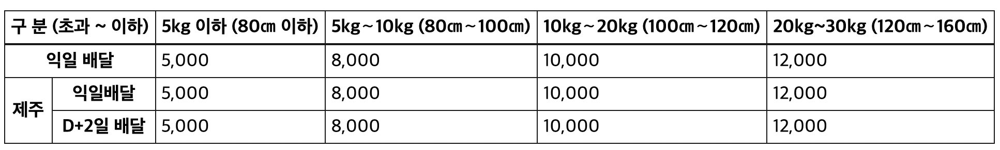

# fastcampus table

웹 접근성을 고려한 테이블 구성하기

## 1. Table 태그와 접근성

`table` 태그는 우리가 흔히 아는 표 형식으로 html 페이지 상에서 자료를 표현하기 위한 _semantic_ 태그이다. 하지만 대부분의 경우 `table` 태그를 **"자료의 표현"** 을 위해서만 사용하며, 접근성을 고려하지 못하는 것 같다 그 예시는 아래와 같다.

---

<div style="margin: 0 auto; width:120px">
    <h1>그냥 표</h1>
    <table>
    <tr>
        <td>이름</td>
        <td>나이</td>
    </tr>
    <tr>
        <td>두영</td>
        <td>25</td>
    </tr>
    </table>
</div>

---

위 표만 보면 어느정도 그럴듯하게 보일지 모르지만(디자인 상으로는), 사실 코드를 보면 전혀 그렇지 못하다.

접근성이라고는 찾아볼 수 없는 html 코드

```html
<html>
  <head>
    ...
  </head>

  <body>
    <div>
      <h1>그냥 표</h1>
      <table>
        <tr>
          <td>이름</td>
          <td>나이</td>
        </tr>
        <tr>
          <td>두영</td>
          <td>25</td>
        </tr>
      </table>
    </div>
  </body>
</html>
```

위 드롭다운 내부의 코드를 보게되면, `table`, `tr`, `td` 만으로 테이블을 표현하고 있다. 사실 이렇게만 표현해도 자료를 충분히 표현할 수 있고, `css`를 이용해서 충분히 예쁘게 꾸밀 수도 있을 것이다. 하지만 전혀 _sementic_ 한 느낌을 주지도 않고 접근성을 아예 고려하지 않은 코드이다.

그럼 어떻게 수정할 수 있을까?

## 2. 접근성을 고려한 table 태그 활용하기

`table`과 관련한 태그들과 속성들을 먼저 알아보겠다.

- `tags`

  - `thead`, `tbody`, `tfoot` 3형제
  - `th`, `tr`, `td`
  - `caption`
  - `colgroup`, `rowgroup`, `col`, `row`

- attributes
  - `scope`, `id`, `headers`
  - ~~`summary`~~ (Deprecated)

사실 스스로도 검색하고 공부해가면서 정리하기 전까지 표를 그리기 위한 간단한 `table` 태그에 이렇게 많은 속성들과 관련 태그들이 존재하는 줄 모르고 있었다. 이렇게까지 많은 태그와 속성들의 필요성을 모르고 있었기 때문인 것 같다.

특히 아래에서 설명하는 몇 가지 중요한 정보들에 대해 자세히 알아보겠다.

### 2.1. `caption`

일단 `caption` 태그는 해당 표에 대한 설명, 목적 등을 알려주는 태그로, 사용자가 표 컨텐츠를 미리보기처럼 빠르게 확인하여 자신에게 필요한 정보인지 아닌지 판단할 수 있도록 해주는 접근성의 기본 중의 기본이 되는 태그이다. 일반적인 사람들에게도 충분히 도움이 되겠지만 특히 스크린 리더와 같은 보조 기술 사용자나, 시력관련 장애인들에게 큰 도움이 된다.

### 2.2. `thead`, `tbody`, `tfoot` 3형제

이 3가지 태그들은 테이블의 행을 그룹짓는 _semantic_ 한 태그들이다. 이러한 태그들을 활용해 위의 `caption`태그와 같이 미리 정보들을 유추할 수 있기 때문에 접근성에 아주 중요한 역할을 한다고 볼 수 있다.

### 2.3 `scope`, `id`, `headers`

시력에 문제가 없는 일반적인 사람들의 경우에는 테이블을 한 눈에 파악할 수 있고, 어떤 주제에 대한 표인지 어떤 행이 어떤 의미를 가지고 어떤 열이 어떠한 의미를 가지는지 곧바로 이해할 수 있다. 하지만, 시력에 문제가 있는 일부 사용자의 경우에는 보조 장치 등을 이용하여 이를 파악해야 하는데 테이블이 복잡해진다면 각각의 자료들(셀)이 어떠한 행과 어떠한 열과 연관성이 있는지 알기가 쉽지 않다.

따라서 위 3가지 속성들을 이용하여 이를 구분해주는 과정을 통해 접근성을 향상시킬 수 있다. 예를 들어서, th 요소에 scope 속성을 지정하고 해당 값으로 col이나 row, rowgroup, colgroup를 할당해 해당 셀이 열의 제목인지 행의 제목인지 등을 알 수 있다. 만약 더 복잡한 경우, headers 속성과 id 속성을 이용해 내용과 그 의미를 연관지을 수도 있다.

따라서, 아래와 같이 수정한다면 접근성을 조금 더 향상 시킬 수 있을 것이다.

```html
<table>
  <!-- caption 태그를 통해서 표에 대한 간랸한 설명 -->
  <caption>
    정두영 개인정보
  </caption>

  <!-- thead로 테이블의 행을 명시적으로 구분해줌 -->
  <!-- scope속성으로 셀들이 영향을 받는 제목 역할을 알 수 있게 해줌 -->
  <thead>
    <tr>
      <th scope="col">이름</th>
      <th scope="col">성별</th>
      <th scope="col">나이</th>
    </tr>
  </thead>

  <!-- tbody로 테이블의 행을 명시적으로 구분해줌 -->
  <!-- scope속성으로 셀들이 영향을 받는 제목 역할을 알 수 있게 해줌 -->
  <tbody>
    <tr>
      <th scope="row">정두영</th>
      <td>남자</td>
      <td>25</td>
    </tr>
  </tbody>
</table>
```

그리고 만약 셀들이 병합되는 등 좀 더 복잡한 테이블의 경우에는 `colgroup`과 `rowgroup`속성을 통해 `col`, `row` 등을 그룹지어주는 과정도 필요하다.

## 3. 실습



위 그림은 간단한 표 예제이다. 사실 만약 내가 접근성이 뭔지도 몰랐을 때 위 표를 마크업한다고 하면, 아마도 다믕과 같은 형식으로 짰을 것이 분명하다.

```html
<!-- 표준? 접근성? 그게 뭐죠? -->

<table>
  <!-- caption 태그의 부재 : 보조기기 사용자들이 해당 표가 무슨 내용인지 전혀 알 수 없는 상태 -->

  <!-- 각각의 셀들이 무슨 연관성을 가지고 배치되어 있는지 전혀 알지 못함-->
  <tr>
    <td colspan="2">구 분 (초과 ~ 이하)</td>
    <td>5kg 이하 (80㎝ 이하)</td>
    <td>5kg∼10kg (80㎝∼100㎝)</td>
    <td>10kg∼20kg (100㎝∼120㎝)</td>
    <td>20kg~30kg (120㎝∼160㎝)</td>
  </tr>
  <tr>
    <td colspan="2">익일 배달</td>
    <td>5,000</td>
    <td>8,000</td>
    <td>10,000</td>
    <td>12,000</td>
  </tr>
  <tr>
    <td rowspan="2">제주</td>
    <td>익일배달</td>
    <td>5,000</td>
    <td>8,000</td>
    <td>10,000</td>
    <td>12,000</td>
  </tr>
  <tr>
    <th>D+2일 배달</th>
    <td>5,000</td>
    <td>8,000</td>
    <td>10,000</td>
    <td>12,000</td>
  </tr>
</table>
```

일단 위 코드를 보면

- `caption` 태그가 있는가? <span style="color:red; font-weight:700">NO</span>
- `thead`, `tbody`, `tfoot`이 있는가? <span style="color:red; font-weight:700">NO</span>
- `scope`속성을 주었는가? <span style="color:red; font-weight:700">NO</span>

접근성에 대해 단 '1'도 고려하지 않은 코드라고 볼 수 있겠다. 하지만 과거의 나라면 단순히 표가 잘 그려지는 것을 보고 만족했을 것이다.
하지만, 접근성을 조금 더 고려해본다면 다음과 같이 개선할 수 있을 것이다.

```html
<table>
  <!-- caption 태그로 확실하게 표의 내용을 정리하고 알려줌 -->
  <caption class="a11y-hidden">
    우체국 택배(방문접수)
  </caption>

  <!-- 테이블의 행들을 깔끔하게 분리해서 명시해줌 -->
  <thead>
    <tr>
      <th colspan="2" scope="row">구 분 (초과 ~ 이하)</th>
      <th scope="col">5kg 이하 (80㎝ 이하)</th>
      <th scope="col">5kg∼10kg (80㎝∼100㎝)</th>
      <th scope="col">10kg∼20kg (100㎝∼120㎝)</th>
      <th scope="col">20kg~30kg (120㎝∼160㎝)</th>
    </tr>
  </thead>
  <tbody>
    <tr>
      <th colspan="2" scope="row">익일 배달</th>
      <td>5,000</td>
      <td>8,000</td>
      <td>10,000</td>
      <td>12,000</td>
    </tr>
    <tr>
      <th rowspan="2" scope="rowgroup">제주</th>
      <th scope="row">익일배달</th>
      <td>5,000</td>
      <td>8,000</td>
      <td>10,000</td>
      <td>12,000</td>
    </tr>
    <tr>
      <th scope="row">D+2일 배달</th>
      <td>5,000</td>
      <td>8,000</td>
      <td>10,000</td>
      <td>12,000</td>
    </tr>
  </tbody>
</table>
```

- `caption` 태그가 있는가? <span style="color:BLUE; font-weight:700">YES</span>
- `thead`, `tbody`, `tfoot`이 있는가? <span style="color:BLUE; font-weight:700">YES</span>
- `scope`속성을 주었는가? <span style="color:BLUE; font-weight:700">YES</span>

이렇게 수정함으로써 디자인적으로는 변함없이, 스크린 리더가 표를 효과적으로 읽어주어 시각적으로 불편한 사람들이 보조기기의 도움을 받아 표를 조금 더 잘 이해할 수 있도록 해줄 수 있게 되었다.

위와 같은 과정들은 시각적인 디자인에는 영향을 주지 않기 때문에 일반적인 사용자들은 눈치채지 못할뿐아니라 필요성조차 느낄 수 없겠지만, 스크린 리더 등의 보조 장치에 의존하여 웹 서비스를 사용하는 일부 사용자들에게는 이전과 비교할 수 없을 정도의 큰 차이를 선사해줄 수 있을 것이다.

테이블이라는 시각적인 자료 정리 틀을 소리로만 의존하기 위해서는 각 행, 열에 나타나있는 정보들을 연관성 있게 읽어주어야 하기 때문에 `scope`, `row`, `col`, `caption` 등 위에서 설명한 모든 속성과 태그들을 활용해 접근성에 대한 고려를 충분히 해야할 것이다.

## 참고자료

- [tutorialspoint - table tag](https://www.tutorialspoint.com/html/html_table_tag.htm)

- [MDN - table](https://developer.mozilla.org/ko/docs/Web/HTML/Element/table)
