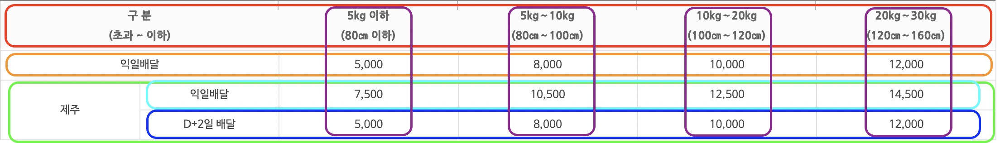
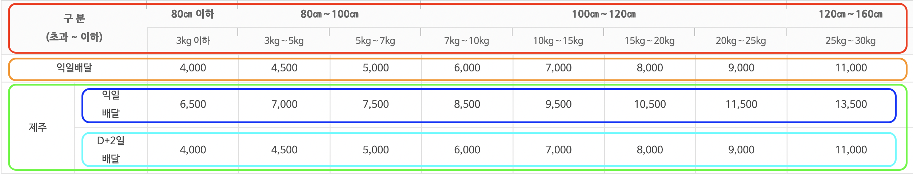
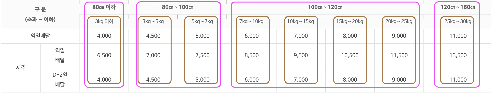

# 접근성 높은 테이블 마크업

## 테이블이란

HTML에서 만드는 표로, 2차원으로 나뉜 공간에 행이나 열을 따라 데이터를 분류하여 보여줄 수 있다.

### HTML과 테이블

테이블에 관련된 요소는 다음과 같다.

|태그명|역할|
|----|----|
|`<table>`|표를 만든다.|
|`<caption>`|표의 제목을 지정한다.|
|`<colgroup>`|열을 묶는 그룹을 지정한다.|
|`<col>`|`<colgroup>`요소에 속하는 각 열의 속성을 정의한다.|
|`<thead>`|표의 헤더에 속하는 영역을 나타내는 태그(머리글)|
|`<tbody>`|표의 본문에 해당하는 태그(실제적인 값)|
|`<tfoot>`|표의 푸터에 속하는 영역을 나타내는 태그(ex.합계, 평균)|
|`<tr>`|표의 행을 나타내는 태그|
|`<td>`|표의 열을 나타내는 태그|

### table, tr, th, td

테이블은 다음과 같은 상위 계층을 가진다.

- `table` (테이블)
    + `tr` (테이블의 열)
        - `th` (데이터 테이블의 제목 셀)
        - `td` (테이블의 내용 셀)

이러한 계층을 가질 때, `th` 요소에 `scope`속성을 사용하여 이 제목 셀이 어느 영역의 제목인지 알려줄 수 있다(ex. `scope="row"`, `scope="col"`). `row`, `col`말고도 `rowgroup`이나 `colgroup`으로 지정할 수 있다.

`td`의 경우 HTML5에서 제목을 주더라도 아웃라인에 영향을 주지 않는다.

여러 셀을 병합하고자 할 땐, 병합 방향에 따라 `rowspan`과 `colspan`을 이용하여 병합할 수 있다.

### caption

표에 대한 전체적인 요약을 적는 태그이다. 사용할 경우 `table`태그 바로 밑에 작성해야한다. 하지만 필수 요소는 아니다. `caption`태그는 `figure`의 `figcaption`대신 사용할 수 있다.

### colgroup, col

열은 하나씩 분리되어있지만, 임의의 열들이 서로 상관관계를 가지고 있다면 `colgroup`으로 마크업할 수 있다. 이 요소는 `caption`태그 다음에 사용해야 하며, `thead`, `tbody`, `tfoot`보다는 앞서서 써야 한다.

> 여기서 `rowgroup`이 없는 이유가 궁금했는데, [WCAG](https://www.w3.org/WAI/tutorials/tables/irregular/)를 보면 `tbody`태그를 여러번 사용하여 줄을 묶을 수 있다고 한다. 이것이 그 이유인 것 같다.

### thead, tbody, tfoot

`thead`, `tbody`, `tfoot`는 표를 행을 기준으로 하여 나눴을 때 구분되는 요소들이다. `thead`는 제목열, `tbody`는 표의 본문, `tfoot`은 소계, 합과 같은 요약된 행을 나타낸다.

`tbody`같은 경우 필수요소이지만, 작성하지 않아도 대부분의 브라우저에서는 이 요소가 있다고 가정하고 DOM을 구성한다.

마크업은 `thead`, `tbody`, `tfoot`(마지막 두 요소는 바뀔 수 있다.)순서로 진행할 수 있다. 순서에 상관없이 렌더링은 `tfoot`을 가장 마지막으로 한다.

> **thead, tfoot요소의 장점**
브라우저에 있는 표의 데이터 양이 많을 경우 스크린 리더는 이를 일일히 접근해야 한다. 하지만 헤더요소와 푸터요소를 미리 정의한다면, 이들 만에 대한 접근이 가능하기 때문에 표를 요약하면서 볼 수 있다.

### scope, id, headers

시각으로 브라우저를 보는 사람들은 제목행이나 열이 차지하는 범위를 손쉽게 알 수 있지만, 스크린 리더를 사용하면 모든 셀에 왼쪽에서 오른쪽으로 접근해야 하기 때문에 정보를 유기적으로 연결하기 힘들다. 이 때문에 `th`요소에 `scope`속성을 사용하면 청각으로도 정보를 구조적으로 전달받을 수 있다.

> **scope속성과 headers속성의 중복 사용**
정보를 중복하여 보여줄 필요가 없기 때문에 자신의 컨벤션에 맞게 작성하면 된다. 하지만 셀 제목 구조 자체가 복잡해지는 경우 `headers`나 `id`를 사용하여 관계를 명확히 정해주는 것이 좋다.

### id, headers 속성을 이용한 접근성 높은 테이블 마크업

`summary`속성이 있지만 이는 표준이 아니다. 따라서 `figure`, `figcatipn`, `aria-describedy`로 요약정보를 제공하는 단락에 연결하거나 `caption` 요소 내에 포함해서 제공할 수 있다.

> **Table 내의 내용이 없는 셀 표현**
값이 없는 셀을 표현할 때 빈 셀로 표현하면 테이블 구조를 이해하는데 어려움을 줄 수 있다. 이 때에는 데이터가 없다는 내용을 포함한 뒤, CSS에서 이를 숨김처리하는 것이 바람직히다.

#### 

테이블 내용에 대한 구체적인 예시는 [블로그](https://seulbinim.github.io/WSA/table.html#scope-id-headers-속성)를 참고하길 바란다.

## 접근성을 고려한 테이블 생성 예시

우체국 택배의 [요금안내](https://parcel.epost.go.kr/parcel/use_guide/charge_1.jsp#contents_layout3)창에 나와있는 표를 예시로 하였다.

### 우체국택배(방문접수)

데이터 간의 연관성을 고려하면 아래와 같은 그림으로 나타낼 수 있다.



<figcaption>우체국택배(방문접수) 데이터 연관성 표</figcaption>

이에 따라 html 마크업을 아래와 같이 하였다.
<details>
<summary>우체국택배(방문접수) html 코드</summary>

```html
<h1>우체국 택배 요금 안내</h1>

    <h2>우체국택배(방문접수)</h2>
    <table>
        <caption>우체국택배(방문접수) 요금표</caption>
        <thead>
            <!-- 빨간색 행 영역 및 보라색 영역 정의 -->
            <tr>
                <th scope="row" colspan="2">구 분<br>(초과 ~ 이하)</th>
                <th scope="col">5kg 이하<br>(80cm 이하)</th>
                <th scope="col">5kg∼10kg<br>(80㎝∼100㎝)</th>
                <th scope="col">10kg∼20kg<br>(100㎝∼120㎝)</th>
                <th scope="col">20kg∼30kg<br>(120㎝∼160㎝)</th>
            </tr>
        </thead>
        <tbody>
            <!-- 주황색 행 영역 정의 -->
            <tr>
                <th scope="row" colspan="2">익일배달</th>
                <td>5,000</td>
                <td>8,000</td>
                <td>10,000</td>
                <td>12,000</td>
            </tr>
            <!-- 초록, 하늘, 파랑 행 영역 정의 -->
            <tr>
                <th scope="rowgroup" rowspan="2">제주</th>
                <!-- 하늘색 행 영역 정의 -->
                <th scope="row">익일 배달</th>
                    <td>7,500</td>
                    <td>10,500</td>
                    <td>12,500</td>
                    <td>14,500</td>
            </tr>
            <tr>
                <!-- 파랑색 행 영역 정의 -->
                <th scope="row">D+2일 배달</th>
                    <td>5,000</td>
                    <td>8,000</td>
                    <td>10,000</td>
                    <td>12,000</td>
            </tr>
        </tbody>
    </table>
```
</details>


여기서 사용한 접근성 향상 방법

1. `thead`, `tbody`를 사용
2. `scope`속성을 이용
3. `table`에 `caption`을 추가
4. `h`태그를 통해 어떠한 요소인지 설명
5. `aria-describedby`를 통한 표 요약 설명 추가

### 소포우편(창구접수)

#### 등기소포
등기소포 표와 위에서 언급했던 우체국택배(방문접수)를 비교하면 크기와 무게에 대한 가격 기준이 더 세분화 된 것을 볼 수 있다. 이를 연관성있는 영역끼리 묶어보면 다음과 같다.

이 경우에는 행과 열을 모두 표시하긴 조금 지저분해 보이기 때문에 행에 대한 묶음과 열에 대한 묶음을 따로 나타낸다.


<figcaption>소포우편(창구접수) 데이터 연관성 표(행)</figcaption>


<figcaption>소포우편(창구접수) 데이터 연관성 표(열)</figcaption>

그림으로보니 차이가 더 확실히 보인다. 하나의 데이터에 관여하는 열의 종류가 훨씬 늘어난 것을 볼 수 있다. 이에 [WCAG](https://www.w3.org/WAI/tutorials/tables/multi-level/)에 따라 `id`와 `headers`를 이용하여 마크업하였다.

<details>
<summary>등기소포 html 코드</summary>

```html
<h2>소포우편(창구접수)</h2>
    <ol>
        <li>등기소포
            <table>
                <caption>등기소포 요금표</caption>
                <colgroup>
                    <col span="2">
                    <col>
                    <col span="2">
                    <col span="4">
                    <col>
                </colgroup>
                <thead>
                    <tr>
                        <th id="size" colspan="2" rowspan="2">구 분<br>(초과 ~ 이하)</th>
                        <th id="80cm" headers="size">80cm 이하</th>
                        <th id="80-100cm" headers="size" colspan="2">80cm ~ 100cm</th>
                        <th id="100-120cm" headers="size" colspan="4">100cm ~ 120cm</th>
                        <th id="120-160cm" headers="size">120cm ~ 160cm</th>
                    </tr>
                    <tr>
                        <th id="3kg" headers="size 80cm">3kg 이하</th>
                        <th id="3kg-5kg" headers="size 80-100cm">3kg~5kg</th>
                        <th id="5kg-7kg" headers="size 80-100cm">5kg~7kg</th>
                        <th id="7kg-10kg" headers="size 100-120cm">7kg~10kg</th>
                        <th id="10kg-15kg" headers="size 100-120cm">10kg~15kg</th>
                        <th id="15kg-20kg" headers="size 100-120cm">15kg~20kg</th>
                        <th id="20kg-25kg" headers="size 100-120cm">20kg~25kg</th>
                        <th id="25kg-30kg" headers="size 120-160cm">25kg~30kg</th>
                    </tr>
                </thead>
                <tbody>
                    <tr>
                        <th id="today" colspan="2">익일배달</th>
                        <td headers="today 80cm 3kg">4,000</td>
                        <td headers="today 80-100cm 3kg-5kg">4,500</td>
                        <td headers="today 80-100cm 5kg-7kg">5,000</td>
                        <td headers="today 100-120cm 7kg-10kg">6,000</td>
                        <td headers="today 100-120cm 10kg-15kg">7,000</td>
                        <td headers="today 100-120cm 15kg-20kg">8,000</td>
                        <td headers="today 100-120cm 20kg-25kg">9,000</td>
                        <td headers="today 120-160cm 25kg-30kg">11,000</td>
                    </tr>
                    <tr>
                        <th id="zezu" rowspan="2">제주</th>
                        <th id="zezu-today" headers="zezu">익일<br>배달</th>
                        <td headers="zezu zezu-today 80cm 3kg">6,500</td>
                        <td headers="zezu zezu-today 80-100cm 3kg-5kg">7,000</td>
                        <td headers="zezu zezu-today 80-100cm 5kg-7kg">7,500</td>
                        <td headers="zezu zezu-today 100-120cm 7kg-10kg">8,500</td>
                        <td headers="zezu zezu-today 100-120cm 10kg-15kg">9,500</td>
                        <td headers="zezu zezu-today 100-120cm 15kg-20kg">10,500</td>
                        <td headers="zezu zezu-today 100-120cm 20kg-25kg">11,500</td>
                        <td headers="zezu zezu-today 120-160cm 25kg-30kg">13,500</td>
                    </tr>
                    <tr>
                        <th id="zezu-delay" headers="zezu">D+2일<br>배달</th>
                        <td headers="zezu zezu-delay 80cm 3kg">4,000</td>
                        <td headers="zezu zezu-delay 80-100cm 3kg-5kg">4,500</td>
                        <td headers="zezu zezu-delay 80-100cm 5kg-7kg">5,000</td>
                        <td headers="zezu zezu-delay 100-120cm 7kg-10kg">6,000</td>
                        <td headers="zezu zezu-delay 100-120cm 10kg-15kg">7,000</td>
                        <td headers="zezu zezu-delay 100-120cm 15kg-20kg">8,000</td>
                        <td headers="zezu zezu-delay 100-120cm 20kg-25kg">9,000</td>
                        <td headers="zezu zezu-delay 120-160cm 25kg-30kg">11,000</td>
                    </tr>
                </tbody>
            </table>
        </li>
        <li>일반소포
            <table>
                <caption>일반소포</caption>
                <colgroup>
                    <col span="2">
                    <col>
                    <col span="2">
                    <col span="4">
                    <col>
                </colgroup>
                <tr>
                    <th scope="rowgroup" colspan="2" rowspan="2">구 분<br>(초과 ~ 이하)</th>
                    <th scope="col">80cm 이하</th>
                    <th scope="colgroup" colspan="2">80cm ~ 100cm</th>
                    <th scope="colgroup" colspan="4">100cm ~ 120cm</th>
                    <th scope="col">120cm ~ 160cm</th>
                </tr>
                <tr>
                    <th scope="col">3kg 이하</th>
                    <th scope="col">3kg~5kg</th>
                    <th scope="col">5kg~7kg</th>
                    <th scope="col">7kg~10kg</th>
                    <th scope="col">10kg~15kg</th>
                    <th scope="col">15kg~20kg</th>
                    <th scope="col">20kg~25kg</th>
                    <th scope="col">25kg~30kg</th>
                </tr>
                <tr>
                    <th scope="row" colspan="2">익일배달</th>
                    <td >2,700</td>
                    <td >3,200</td>
                    <td >3,700</td>
                    <td>4,700</td>
                    <td>5,700</td>
                    <td>6,700</td>
                    <td>7,700</td>
                    <td>9,700ㅍ</td>
                </tr>
            </table>
        </li>
    </ol>
```
</details>

일반 소포에 대한 표는 소포우편(창구접수)에서 빨강색과 주황색 영역을 잘라낸 부분이기 때문에 비교적 구조가 간단하여 `scope`속성을 이용하였다. id를 하나하나 주다보니 오타가 나거나 빼먹는 경우가 생겨 왠만하면 `scope`를 이용하는게 좋다고 생각한다.

여기서 사용한 접근성 향상 방법은 다음과 같다.

1. `thead`, `tbody`를 사용
2. `header`, `id`, `scope`속성을 이용
3. `table`에 `caption`을 추가
4. `h`태그를 통해 어떠한 요소인지 설명
5. `ol`태그를 사용하여 두 테이블이 연관되어 있음을 표시

### 부가이용 수수료(등기소포를 전제로 취급지역에 한함)

